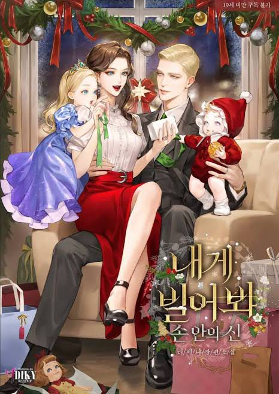

<!-- Dynamic Title Effect (Imperial, Cinzel font, Gold color, Smooth transition) -->

<!-- Badges in the large 'for-the-badge' style for maximum impact -->
<!-- GENRE BADGE (Deep Red/Maroon) -->

<!-- STATUS BADGE (Warm Bronze/Brown) - UPDATED TO COMPLETE -->

<!-- FORMAT BADGE REMOVED -->

  
   
  <em><i>Try Begging</i></em>

<!-- Left-aligned content starts here, giving a structured feel -->

<!-- Synopsis / Hook -->

Absoulue peak written by author [Libenia](https://x.com/_libenia_)

Translation taken from Scribd

